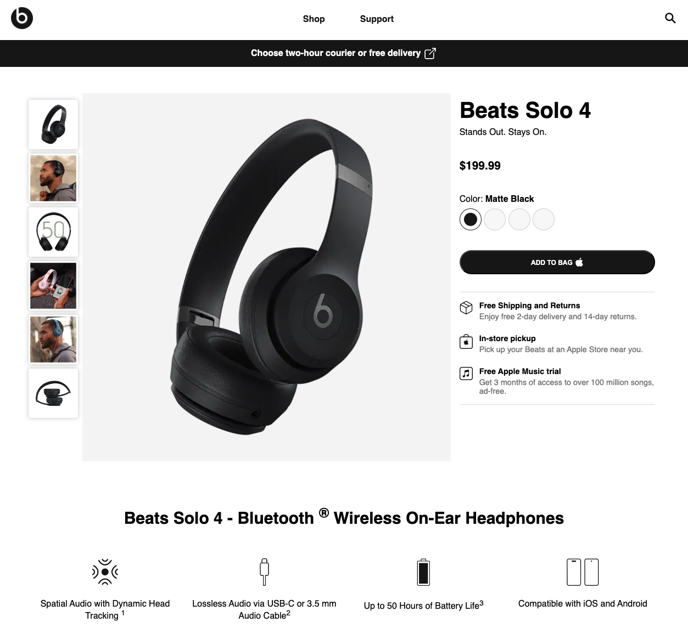

# Beats Solo 4 - Design clone

This project is a student assignment for Høyskolen Kristiania, replicating the design of the [Beats Solo 4 headsphones](https://www.beatsbydre.com/headphones/solo4-wireless/MUW23/solo4-matteblack). The product page (index) is a simplified version of the original, and the checkout page is fictional, created for educational purposes.

**Published website:** https://sbraende-beats-solo.netlify.app/



## Features

- **Responsive Design:** Optimized for both desktop and mobile devices.
- **Lightweight:** Built using vanilla HTML and CSS for simplicity and performance.

## Installation

1. Clone the repository:

```bash
git clone https://github.com/sbraende/beats-solo-clone
```

2. Navigate into the source directory:

```bash
`cd beats-solo-clone/src`
```

3. Open `index.html` in your favorite browser to get started.
